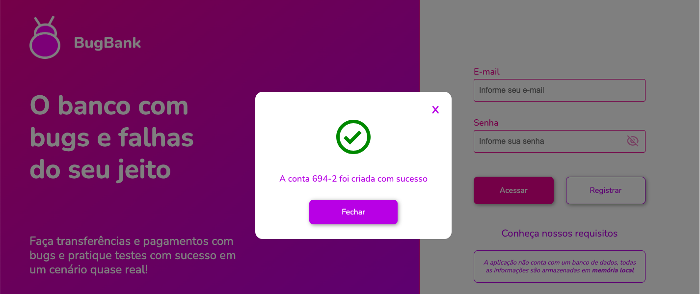
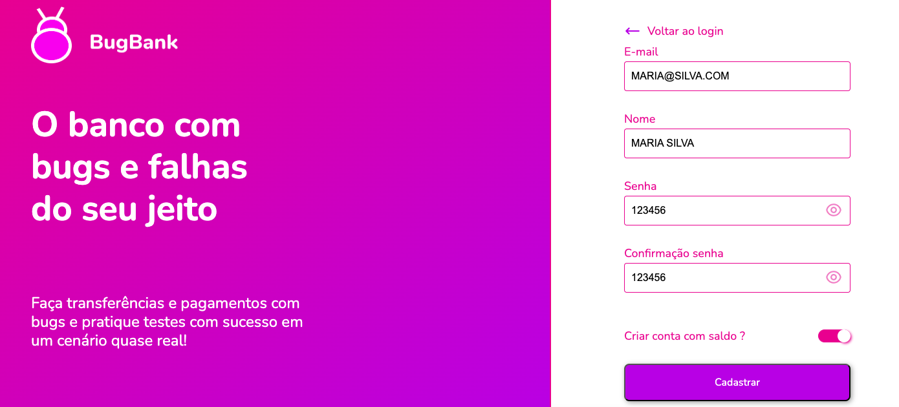
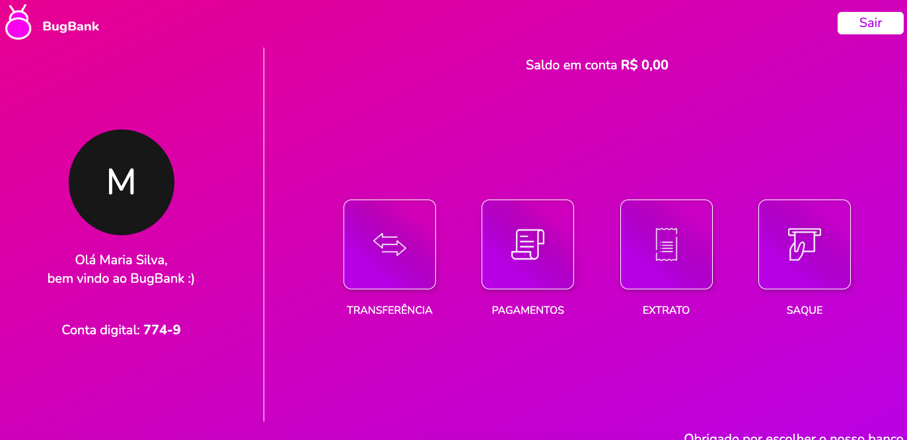
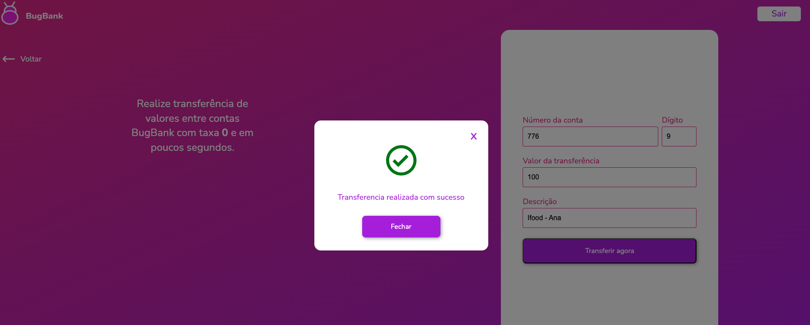

# 🧪 Suíte de Testes Funcionais & E2E - BugBank

> Mapeamento de cenários de teste, execução de testes de caixa-preta, validações de regras de negócio e análise de experiência do usuário (UX) realizados sobre a aplicação **BugBank**.

---

## 🌐 Sobre a Aplicação Testada
* **Aplicação:** BugBank (Banco Fictício para Treinamento de QA)
* **Ambiente de Teste:** Web / Desktop
* **Tipos de Testes Aplicados:** Testes de Interface (UI), Validação de Formulários, Regras de Negócio, Casos de Borda e Fluxo End-to-End (E2E).

---

## 📋 Suíte de Testes Mapeados

| ID | Cenário / Título | Tipo de Teste | Prioridade | Status | Observações / Análise Técnica |
| :--- | :--- | :--- | :--- | :--- | :--- |
| **`CT-CAD-01`** | Cadastro de usuário com dados válidos | Caminho Feliz | Alta 🔴 | `Passou ✅` | Fluxo principal de criação de conta concluído com sucesso. |
| **`CT-CAD-02`** | Validação de e-mail em formato inválido | Validação / Negativo | Alta 🔴 | `A Executar ⚪` | Teste para garantir validação do formato do e-mail no formulário. |
| **`CT-CAD-03`** | Cadastro informando apenas o primeiro nome | Regra de Negócio | Média 🟡 | `Passou ✅ / UX` | A tela solicitou "Nome" e aceitou uma palavra. Sugestão de UX: Exigir Sobrenome. |
| **`CT-CAD-04`** | Cadastro e login com dados em CAPS LOCK | Caso de Borda | Média 🟡 | `Passou ✅` | Tratamento de caixa de texto (`toLowerCase()`) validado com sucesso na autenticação. |
| **`CT-CAD-05`** | Divergência de valores no campo "Confirmar Senha" | Validação / Negativo | Alta 🔴 | `A Executar ⚪` | Valida a checagem de igualdade de senhas antes do envio do formulário. |
| **`CT-CAD-06`** | Criação de conta com saldo inicial atribuído | Regra de Negócio | Média 🟡 | `Passou ✅` | Atribuição correta do valor inicial exibido no dashboard. |
| **`CT-CAD-07`** | Criação de conta com saldo zerado | Regra de Negócio | Média 🟡 | `Passou ✅` | Renderização limpa de `R$ 0,00` sem erros de `NaN` ou `null`. |
| **`CT-TRF-01`** | Execução de transferência entre contas | Fluxo E2E | Alta 🔴 | `Passou ✅` | Movimentação financeira, débito do saldo e histórico validados. |

---

## 📸 Evidências dos Testes

### 1. Cadastro Realizado com Sucesso (`CT-CAD-01`)

---

### 2. Login com Tratamento de Caixa Alta (`CT-CAD-04`)

---

### 3. Validação de Conta com Saldo Zerado (`CT-CAD-07`)

---

### 4. Execução de Transferência com Sucesso (`CT-TRF-01`)

---

## 🧠 Aprendizados e Visão Técnica
* **Análise de Requisitos vs. UX:** Identificação da diferença entre comportamento esperado de tela e melhorias de produto (como a inclusão de sobrenome no formulário).
* **Sanitização de Dados:** Compreensão da importância de tratar entradas de texto (como e-mails) antes de salvar no banco de dados.
* **Integridade em Fluxo E2E:** Verificação de como ações no cadastro (como escolha de saldo) refletem na funcionalidade posterior de transferência financeira.

---
*Estudo de caso desenvolvido para portfólio de Qualidade de Software & Desenvolvimento.*